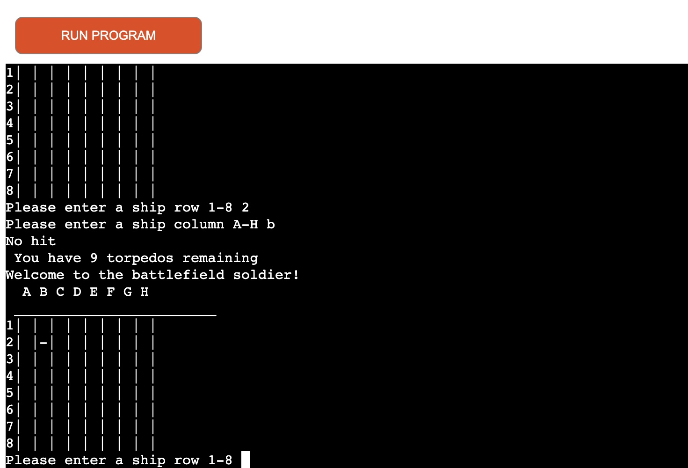
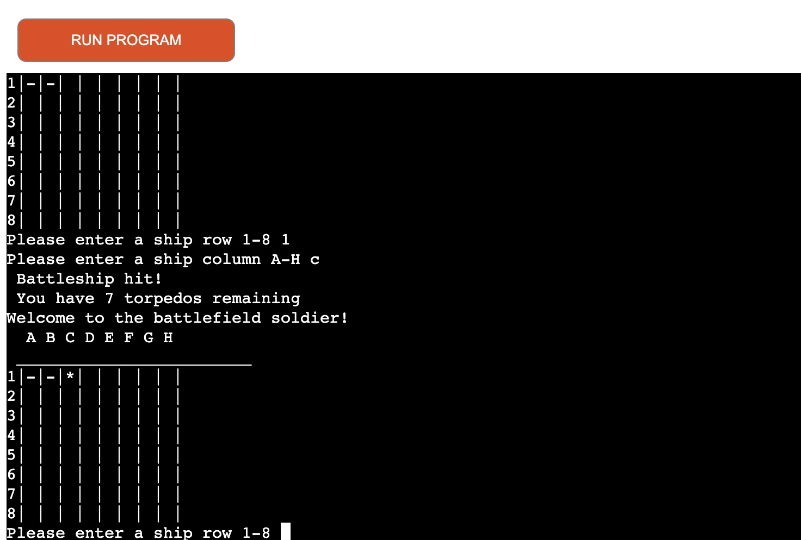
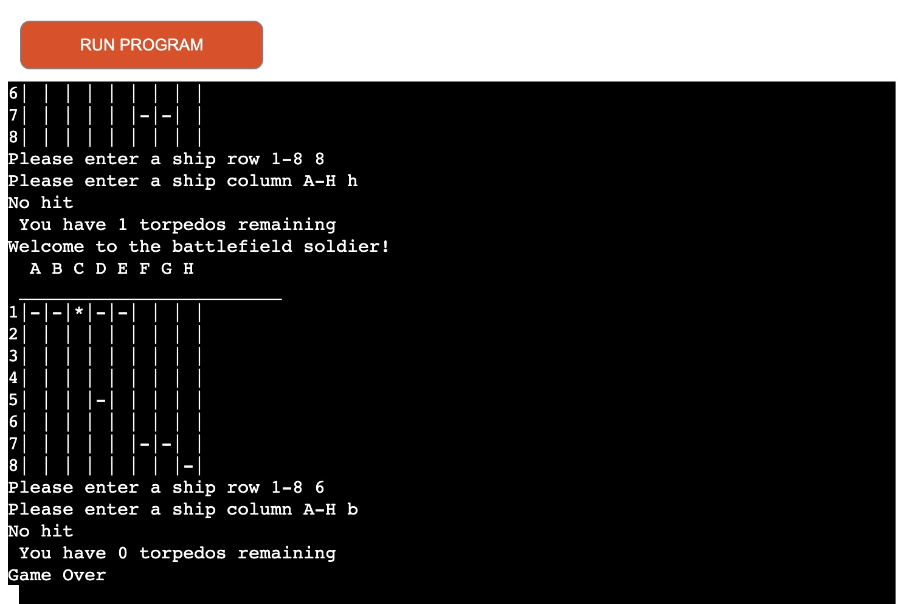
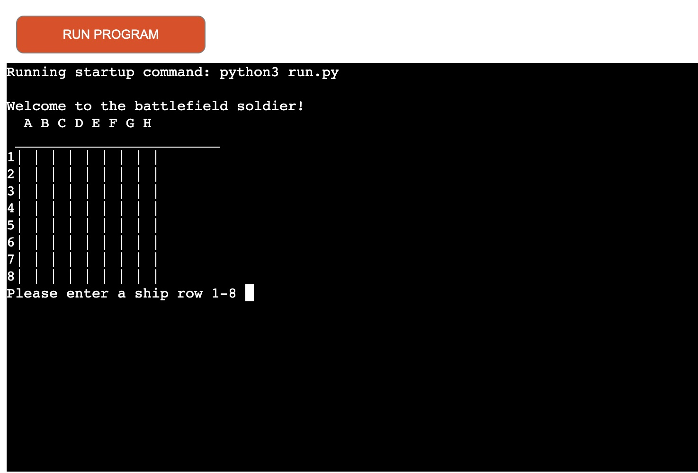

 

## ++Welcome to BATTLESHIPS++

 

This project is coded using Python.

Battleship (also known as Battleships or Sea Battle is a strategy type guessing game for two players. It is played on ruled grids (paper or board) on which each player's fleet of warships are marked. The locations of the fleets are concealed from the other player. Players alternate turns calling "shots" at the other player's ships, and the objective of the game is to destroy the opposing player's fleet.

Battleship is known worldwide as a pencil and paper game which dates from World War I. It was published by various companies as a pad-and-pencil game in the 1930s and was released as a plastic board game by Milton Bradley in 1967. The game has spawned electronic versions, video games, smart device apps and a film.

 

### ++Playing Instructions++:  

1.The game starts with loading a 8 x 8 board

A player has 10 tries to find the hidden ships on the board. Each round the user is asked to select a row between 1 and 8 and a colum A to H. If the user guess the correct location of the ship and a hit is made the location is marked with '*'. If a hit is made but no ships is at this location the board is marked with '-'.

If all 10 tries have been used but not all 4 ships have been hit, the game is over and the player has lost.

 

 
 
 
Player has to select a row and colum where to hit

   
 
If the selected coordinates didnt hit a ship the board will be marked with '-' at selected location.

  

 
 
 
If the coordicates are a hit the spot is marked with '*'
  
 
 
  

After 10 round or if all 4 ships have been hit the game is over and board is reset with battleships placed at new locations at random.
   
 
  
 
### ++Testing++:

1. The app has been tested by trying to give values outside requirment and app returned an error and asked again for correct values to be entered. I have also tried entering a integer instead of a string and this also asked for a re-entry. I have played the game and tested to only have 10 rounds and for the app to indicate when a battleship is hit or if it is missed. If all battleships are hit the app declares the player a winner.

### ++Validator Testing++:

1. PEP8 code validator
    - 1 error was found when passing through the PEP8 validator
    - 74: W292 no newline at end of file
 

### ++Deployment++:

When you create the app, you will need to add two buildpacks from the _Settings_ tab. The ordering is as follows:

1. `heroku/python`
2. `heroku/nodejs`

You must then create a _Config Var_ called `PORT`. Set this to `8000`

If you have credentials, such as in the Love Sandwiches project, you must create another _Config Var_ called `CREDS` and paste the JSON into the value field.

Connect your GitHub repository and deploy as normal.

The live link can be found here - https://battl3ships.herokuapp.com/

### ++Credits++:
* I have researched javatpoint.com and also youtube channel Knowledge Mavens to help make this app possible.
* Online coding community and slack was also helpfull with debugging and getting the coding correct.